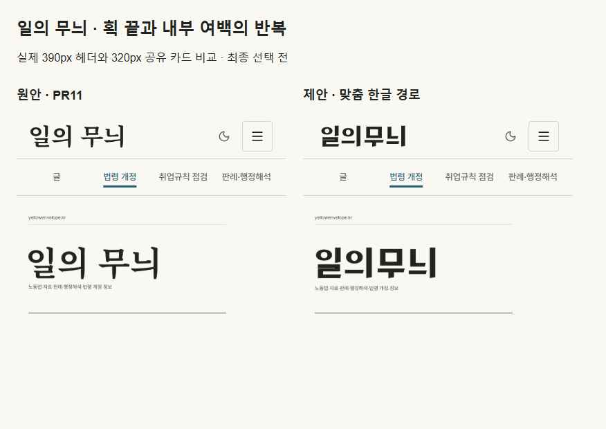
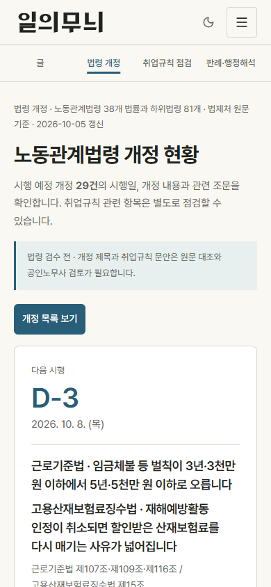
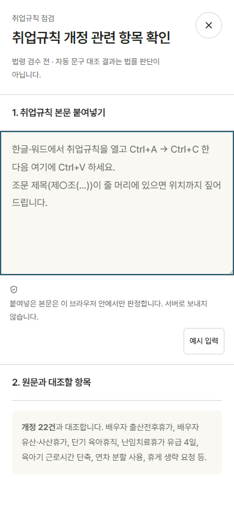
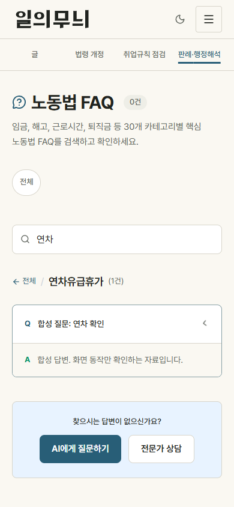
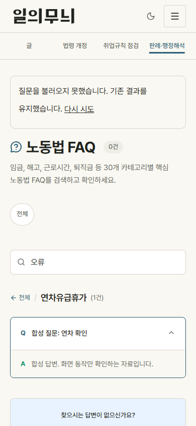
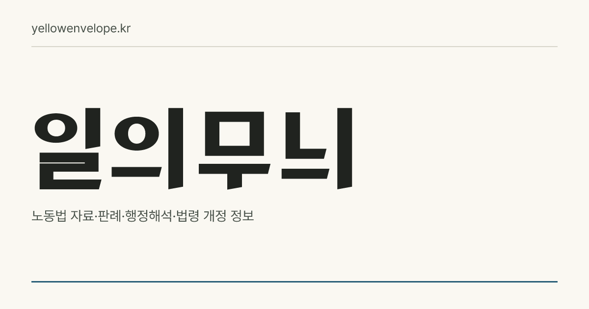
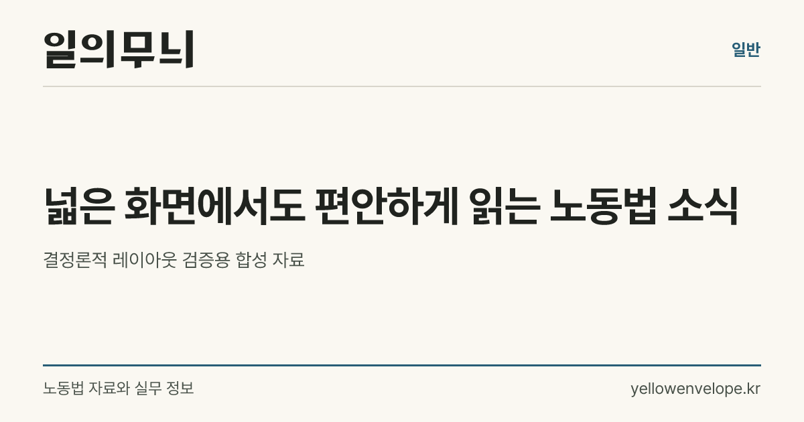

# PR12 최종 코드 화면 검증

앱 코드 기준: 3803470 (FAQ 오류 복구 포함). 모든 PNG를 이 코드의 production fixture 빌드에서 새로 렌더했습니다. 원안/제안 워드마크는 사용자 최종 선택 전입니다.

253개 단위 테스트, tsc --noEmit, production build (103개 정적 페이지) 통과. 변경 파일 ESLint 오류 0, 기존 FaqCategory 미사용 경고 1. 실제 diff는 94a3232 이후와 작업 시작 5810abd 이후를 구분합니다.

| 경로 | 이번 검증 | 남은 범위 |
|---|---|---|
| /laws | 모바일·데스크톱·다크, 상세→점검, Escape 복귀, 검색 빈 결과 | 법령 원문 정확성·수집 timeout 재검증 없음 |
| /tools/work-rules | 모바일, 점검 열기, 기준 로딩 실패 안내 | 실제 사업장 입력·법률 검수 없음 |
| /blog | 안전한 요약 텍스트, frozen 원문 보존 회귀 | 운영 DB 불변; 실제 DB 조사 없음 |
| /faq/연차유급휴가 | 합성 답변 펼침, 전체 복귀, 오류 시 답변 유지·재시도 | 운영 FAQ 분류·답변 검수 없음 |
| /decisions 및 나머지 공개 경로 | route-current.json의 새 상태·가로 넘침 결과 | 각 기능 업무 시나리오·운영 외부 연동은 미검수 |
| OG | 실제 일반/글/법령 renderer; 390px 헤더와 320px 카드 비교 | 워드마크 선택 전 |

색 대비: 5개 경로 × 라이트/다크의 270개 표시 텍스트 표본, 불투명 부모 배경 기준. 테마 전환 완료 후 검사. 전체 접근성 인증은 아닙니다. 원문 law_cite 보존 회귀는 이번 253개 테스트에 포함합니다.

Library 비교 이미지 저장 성공: libfile_8e2cc3c89dcc8191a2ec07f96856b96c (file_0000000010188206a68a3893a548aa0c). Windows 메타데이터 helper: AttributeError: module 'os' has no attribute 'setxattr'. 나머지 이미지 일괄 저장: library upload failed: Library prepare_uploads is not available. 저장/검증 기록은 JSON 참조.

GitHub 화면 경로: https://github.com/seojaehong/labor-law-guide/tree/codex/laws-design-review-20261005/docs/design-visuals
