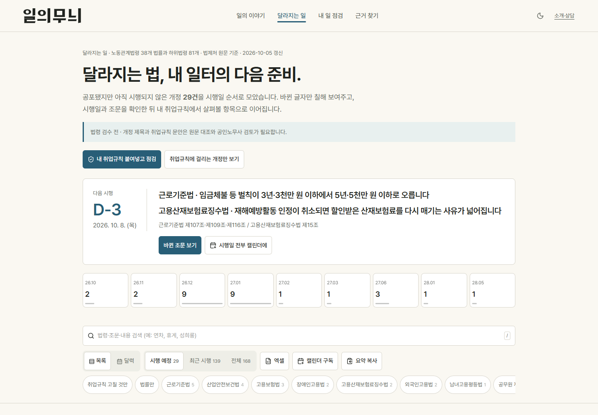
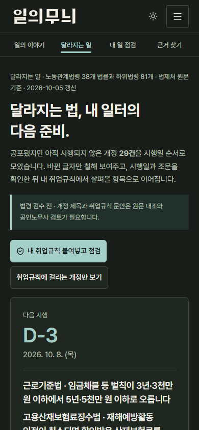
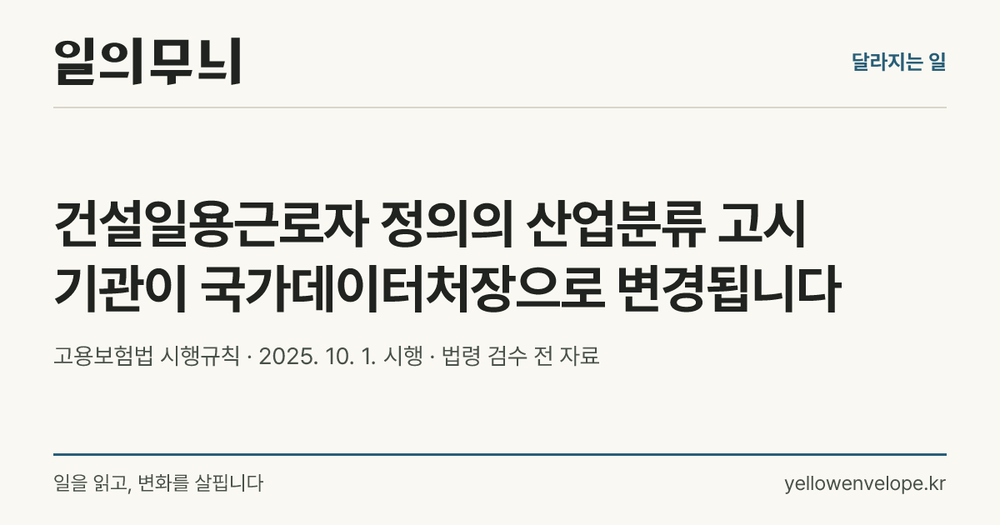
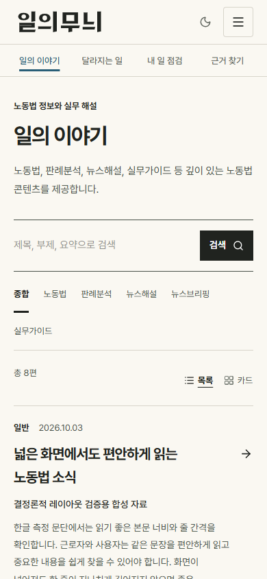
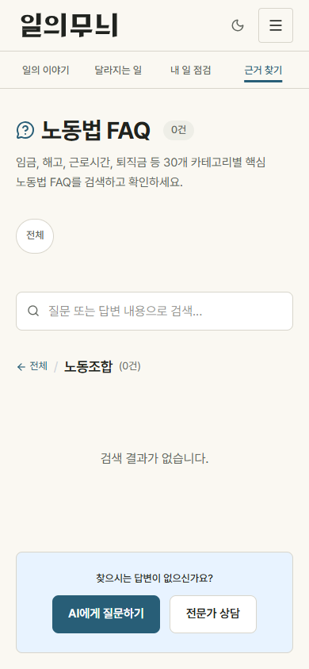

# 일의 무늬 디자인 시각 검토

아래 이미지는 읽기 전용 합성 자료 환경의 실제 브라우저 및 OG 렌더링 결과입니다. 실데이터 법률 검수·수집 정상 운영을 의미하지 않습니다. 워드마크 원안/제안안은 최종 선택 전입니다. Library 저장은 공식 업로드 경로의 가용성 오류로 미완료이며 Library ID는 발급되지 않았습니다.

코드 기준은 `8439588180708d26b40185f385da65ddc5cb8619`입니다. 게시 커밋은 이 코드에 이미지·검사 기록만 추가합니다. 모든 PNG는 해당 코드의 production fixture 빌드에서 재렌더하며 파일 해시는 artifact-manifest.json에 기록합니다.

## 실제 헤더와 OG의 워드마크 비교

원안의 명조 경로와 달리 제안은 열린 내부 여백·같은 각도로 잘린 획 끝을 반복하는 맞춤 한글 경로입니다. 새 심벌이나 생성형 이미지는 쓰지 않았습니다. 실제 헤더 390px, 공유 카드 320px 표시를 비교합니다.

## 데스크톱·모바일·다크·점검 모달

## 공유 이미지

## 요약과 FAQ 분류 상세

FAQ 분류는 기존 실제 이름을 사용한 합성 빈 결과 화면이며 법률 답변·운영 분류 정확성 검증이 아닙니다.
