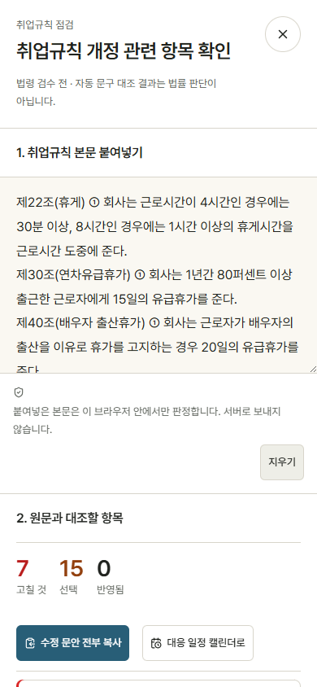

# PR12 최종 코드 화면 검증

앱 코드 기준: 31d3422 (FAQ 오류 복구 포함). 모든 PNG를 이 코드의 production fixture 빌드에서 새로 렌더했습니다. 사용자 거절 결정에 따라 실제 헤더와 일반·글·법령 OG의 기본값은 기존 명조 워드마크입니다. 기하학 제안은 거절된 참고 아티팩트로만 남기며 새 로고 제작·확정은 별도 재검토 전까지 중지합니다.

256개 단위 테스트와 FAQ 응답 순서 브라우저 회귀 2개, tsc --noEmit, production build (103개 정적 페이지) 통과. 변경 파일 ESLint 오류 0, 숫자 요청 ID ref cleanup에 대한 exhaustive-deps 경고 1. 실제 diff는 94a3232 이후와 작업 시작 5810abd 이후를 구분합니다.

| 경로 | 이번 검증 | 남은 범위 |
|---|---|---|
| /laws | 모바일·데스크톱·다크, 상세→점검, Escape 복귀, 검색 빈 결과 | 법령 원문 정확성·수집 timeout 재검증 없음 |
| /tools/work-rules | 모바일, 점검 열기, 기준 로딩 실패→재시도 성공→예시 입력 후 실제 점검 결과 | 실제 사업장 입력·법률 검수 없음 |
| /blog | 안전한 요약 텍스트, frozen 원문 보존 회귀 | 운영 DB 불변; 실제 DB 조사 없음 |
| /faq/연차유급휴가 | 합성 답변 펼침, 전체 복귀, 오류 시 답변 유지·재시도 | 운영 FAQ 분류·답변 검수 없음 |
| /decisions 및 나머지 공개 경로 | 31개 공개 경로 × 390px/1440px의 62건 모두 HTTP 200·가로 넘침 없음 (route-current.json) | 각 기능 업무 시나리오·운영 외부 연동은 미검수 |
| OG | 실제 일반/글/법령 renderer; 390px 헤더와 320px 카드 비교 | 기존 명조가 기본, 거절된 기하학안은 비교 자료 |

색 대비: 5개 경로 × 라이트/다크의 270개 표시 텍스트 표본, 불투명 부모 배경 기준. 테마 전환 완료 후 검사. 전체 접근성 인증은 아닙니다. 원문 law_cite 보존 회귀는 이번 256개 테스트에 포함합니다.

Library 비교 이미지 저장 성공: libfile_8e2cc3c89dcc8191a2ec07f96856b96c (file_0000000010188206a68a3893a548aa0c). Windows 메타데이터 helper: AttributeError: module 'os' has no attribute 'setxattr'. 나머지 이미지 일괄 저장: library upload failed: Library prepare_uploads is not available. 저장/검증 기록은 JSON 참조.

GitHub 화면 경로: https://github.com/seojaehong/labor-law-guide/tree/codex/laws-design-review-20261005/docs/design-visuals

추가 보완: 늦은 이전 FAQ 응답이 최신 검색·분류 결과를 덮지 않도록 요청 ID 가드와 분류/페이지 전환 시 타이머 취소를 적용했습니다. 기존 문제 보완이며 새 회귀라는 주장은 하지 않습니다. 네 주메뉴 실제 클릭·뒤로/앞으로·선택 상태·Escape/포커스 복귀를 docs/design-navigation-interaction.json에 현재 코드 기준으로 갱신했습니다.

재현: node tests/layout/production-visual-fixture.mjs build 후 같은 스크립트 start (로컬 fixture 4321, 웹 3126). playwright.faq-race.config.ts로 FAQ 회귀 실행. 시각 실행 스크립트에는 VISUAL_BASE_URL=http://127.0.0.1:3126을 지정합니다. 실제 API 자격 증명은 사용하지 않습니다.

기본값 복원 회귀: 일반·콘텐츠 OG의 실제 SVG 바이트가 기존 명조 원본과 일치하고 다크 헤더는 원본 경로에 fill만 바꿉니다. 실제 일반 OG PNG와 명시적 original 비교 PNG의 일치도 검증합니다. 기존 모바일 레이아웃·메뉴·FAQ·원문 표시 수정은 그대로 유지합니다.

복원된 기존 명조 일반 OG의 Library ID: libfile_f8a37ea9c988819192dca27eb8b7aa10 (file_000000008084820699d9f3a01cca35ee). 기존 비교 이미지 Library ID는 과거 제안 검토 자료입니다. Windows 메타데이터 기록만 os.setxattr 미지원으로 실패했고 이미지 저장은 성공했습니다.
